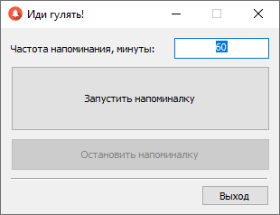
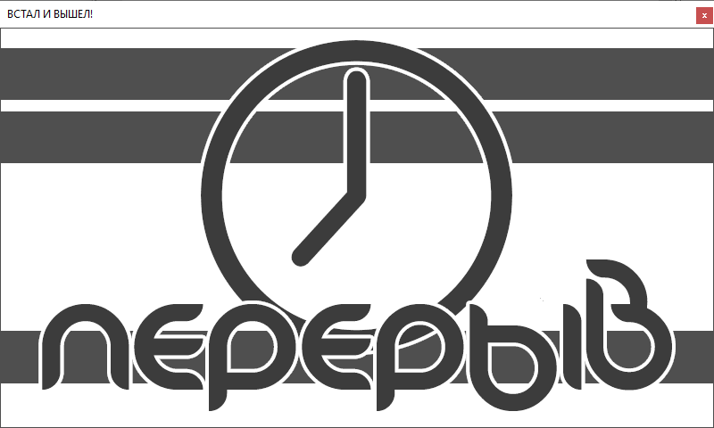

# Будильник программиста
Напоминание о моргании.
 
С заданным промежутком выводится сообщение, напоминающее о передышке, необходимости встать из-за компьютера и пошевелиться.

Всё ради сохранения зоровья программиста.

 

 
